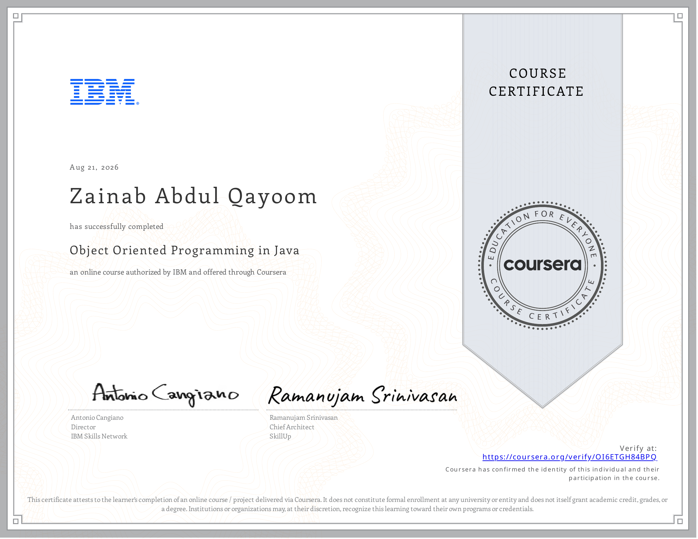

# Object Oriented Programming in Java (IBM)
📍 Course: [Coursera - Object Oriented Programming in Java](https://www.coursera.org/learn/object-oriented-programming-in-java)
Part of the IBM Java Developer Professional Certificate.
## What This Covers
- OOP basics: classes, objects, access & non-access modifiers, encapsulation, constructors
- Inheritance, polymorphism, interfaces & abstract classes, inner classes
- Java Collections Framework: lists, sets, queues, maps
- File handling: streams, byte streams, directories
- Date and Time handling: formatting, time zones, parsing
- Final project + certificate exam
## Modules
1. OOP Basics
2. Advanced OOP
3. Working with Collections
4. File Handling
5. Date and Time Handling
6. Final Project
## Certificate
✅ Completed August 21, 2026
Verify at: [coursera.org/verify/OI6ETGH84BPQ](https://coursera.org/verify/OI6ETGH84BPQ)

